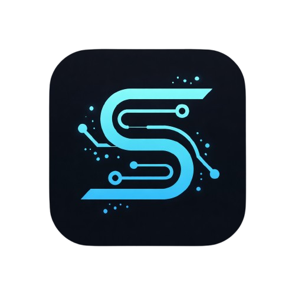

# 🌌 Silvio.AI — Personal Portfolio

<div align="center">
  
  <br />

[](https://nextjs.org/)
[](https://reactjs.org/)
[](https://tailwindcss.com/)
[](https://firebase.google.com/)
[](https://firebase.google.com/docs/genkit)

**Data Scientist | AI Engineer | Informatics Undergraduate**  
*Transforming unstructured data into intelligent, production-ready solutions.*

[Live Demo](https://silvio-ai-portfolio.vercel.app/) • [View Projects](https://github.com/viochris?tab=repositories) • [Contact Me](mailto:viochristian12@gmail.com)

</div>

---

## 🚀 About The Project

**Silvio.AI** is a high-performance personal portfolio designed to showcase the intersection of Data Science and AI Engineering. Built with a futuristic "Cyberpunk-Hacker" aesthetic, it prioritizes technical transparency, interactive user experience, and seamless integration with external AI engines.

This project serves as a living laboratory for my work in **Natural Language Processing (NLP)**, **Predictive Modeling**, and **Autonomous AI Agents**. Unlike standard static portfolios, Silvio.AI utilizes **Genkit** as an orchestration layer to communicate with specialized backends on Hugging Face Spaces.

---

## ✨ Key Features

### 🤖 Neural Chatbot Assistant
A live RAG-powered AI interface using **Genkit** and calling a specialized FastAPI backend on Hugging Face Spaces.
- **Dynamic Status Check**: Features a "Neural Engine" status check that pings the external API to notify the user if the server is active, checking, or waking up.
- **Multilingual Support**: Switchable interface between English and Indonesian.
- **Context-Aware**: Maintains conversation history for multi-turn reasoning.
- **Server-Side Flows**: Uses Genkit `defineFlow` to securely handle API communication without exposing endpoints to the client.

### 📟 System Bootloader
An immersive terminal-style loading sequence simulating a BIOS/Kernel initialization.
- Built with **Framer Motion** and React state hooks.
- Simulates resource checks for React components, Tailwind, and AI Engines.
- Provides a "Hacker" feel while assets load in the background.

### ♾️ Seamless Tech Marquee
A perfectly gapless, infinite-looping tech stack display.
- Custom CSS keyframes optimized for high refresh rates.
- Features over 25+ official brand icons.
- Responsive scaling for mobile and desktop displays.

### 📊 Skill Radar Architecture
Visual proficiency mapping using custom SVG-based Radar Charts.
- Maps expertise in GenAI, NLP, Data Modeling, ML, Backend, and Cloud.
- Interactive progress bars with precise percentage indicators.
- Dynamic data rendering for real-time proficiency updates.

### 🔍 Verified Credentials Hub
A searchable and filterable database of professional certifications.
- Includes credentials from **Oracle (AI Vector Search, Generative AI)**, **IBM (Machine Learning)**, and **Dicoding**.
- Real-time search filtering and category switching.
- Integrated verification links for professional trust.

### 🔄 Interactive Avatar Toggle
A hidden "Easter Egg" in the Hero section allowing users to toggle between a professional photo and an AI-animated version.

### 🎨 Global Vibe Theme System
A custom theme orchestration layer allowing users to switch the "vibe" of the entire portfolio.
- **Neural Blue**: The default technical aesthetic.
- **Cyber Lime / Synth Purple / Volcanic Red / Amber Circuit / Neon Rose**: Various high-contrast themes.
- Managed via `NavigationContext` and CSS variables for instant propagation.

---

## 🛠️ Tech Stack

### **Frontend & Core**
- **Framework**: Next.js 15 (App Router)
- **Library**: React 19
- **Styling**: Tailwind CSS
- **Icons**: Lucide React & Simple Icons
- **Animations**: Framer Motion & Tailwind Animate
- **Components**: Shadcn UI (Radix UI Primitives)

### **AI & Data Science**
- **Orchestration**: Genkit AI (v1.x Server Flows)
- **LLM Integration**: Google Gemini 2.5 Flash
- **Visualization**: Recharts (Commit Graph) & Custom SVG Radar Charts
- **Backend API**: Hugging Face Spaces (FastAPI / LangGraph)
- **NLP Models**: SBERT, TF-IDF, RoBERTa (via external APIs)

### **Infrastructure & Database**
- **Platform**: Firebase App Hosting
- **Database**: Firestore (for Contact Messages)
- **Authentication**: Firebase Auth (Google Provider ready)
- **Monitoring**: Firebase Error Emitter (custom handling for Firestore permissions)

---

## 🏗️ Architecture & Technical Design

### **1. AI Orchestration with Genkit**
The portfolio uses Genkit to define server-side flows. The `chatWithAIAssistantFlow` acts as a secure bridge between the client and a Hugging Face FastAPI backend.

```typescript
// Example of a Genkit Flow defined in the project
const chatWithAIAssistantFlow = ai.defineFlow(
  {
    name: 'chatWithAIAssistantFlow',
    inputSchema: ChatWithAIAssistantInputSchema,
    outputSchema: ChatWithAIAssistantOutputSchema,
  },
  async ({text, language, history}) => {
    const apiUrl = 'https://silvio0-silvio-portfolio-api.hf.space/assistant';
    const apiResponse = await fetch(apiUrl, { ... });
    return {answer: data.answer};
  }
);
```

### **2. Firebase Data Schema**
Firestore is utilized to capture lead generation and contact inquiries. The rules are strictly configured to prevent public reads of submitted messages.

| Collection | Document | Fields | Access |
| :--- | :--- | :--- | :--- |
| `contactMessages` | `{messageId}` | `name`, `email`, `subject`, `message`, `createdAt` | Create only |

### **3. Error Handling Architecture**
A specialized `error-emitter.ts` system is used to catch and surface Firestore permission errors directly to the UI, ensuring developer transparency during maintenance.

---

## 📂 Project Structure

```text
silvio-ai/
├── public/               # Static assets (icon.png, CV, images)
├── src/
│   ├── ai/               # Genkit flows and AI logic
│   │   ├── flows/        # chat-with-ai-assistant.ts (The AI core)
│   │   ├── genkit.ts     # Genkit initialization with Google AI plugin
│   │   └── dev.ts        # Genkit development server entry
│   ├── app/              # Next.js 15 App Router
│   │   ├── about/        # Detailed roadmap and commit metrics
│   │   ├── contact/      # Contact form with Firebase integration
│   │   ├── projects/     # Featured projects case studies
│   │   ├── repository/   # Searchable GitHub database
│   │   ├── skills/       # Radar chart and tech stack visualization
│   │   └── layout.tsx    # Root layout with Firebase Client Provider
│   ├── components/       # Reusable UI & Core modules
│   │   ├── ui/           # Shadcn UI primitives (Accordion, Dialog, etc.)
│   │   ├── Chatbot.tsx   # Interactive AI Assistant UI
│   │   ├── TechMarquee.tsx # Gapless tech stack loop
│   │   └── BootLoader.tsx # Immersive BIOS loading sequence
│   ├── context/          # React Context (Navigation & Vibe state)
│   ├── firebase/         # Firebase Client SDK & custom hooks
│   │   ├── firestore/    # useCollection and useDoc hooks
│   │   ├── auth/         # useUser hook
│   │   └── errors.ts     # Specialized FirestorePermissionError
│   ├── hooks/            # Custom React hooks (useToast, useMobile)
│   └── lib/              # Utils, static data (credentials-data.ts)
├── docs/                 # Backend specifications (backend.json)
├── firestore.rules       # Security rules for document access
├── tailwind.config.ts    # Custom themes and cyberpunk animations
└── package.json          # Dependencies (Next 15, Genkit 1.28, Firebase 11)
```

---

## 📂 Highlighted Repositories

| Project Name | Type | Key Tech |
| :--- | :--- | :--- |
| **InsightSQL (LangGraph)** | GenAI | LangGraph, Gemini, SQL |
| **SpendSense** | Data Science | Streamlit, Gemini Vision, Pandas |
| **Resume Scanner API** | Backend | FastAPI, SBERT, TF-IDF |
| **InsightData** | GenAI | Pandas Agent, Gemini 2.5 Flash |
| **NovaCal AI** | Automation | LangChain, Telegram Bot |
| **Stuntify API** | MLOps | FastAPI, Scikit-Learn |

---

## 💻 Getting Started

### **Prerequisites**
- Node.js (v18.x or later)
- npm or yarn
- Google Generative AI API Key (Gemini)
- Firebase Project for Firestore usage

### **Installation**

1. **Clone the repository:**
   ```bash
   git clone https://github.com/viochris/silvio-ai-portfolio.git
   cd silvio-ai-portfolio
   ```

2. **Install dependencies:**
   ```bash
   npm install
   ```

3. **Setup Environment Variables:**
   Create a `.env` file in the root directory:
   ```env
   GOOGLE_GENAI_API_KEY=your_api_key_here
   ```

4. **Run the development server:**
   ```bash
   npm run dev
   ```

5. **Start Genkit Dev UI (Optional):**
   ```bash
   npm run genkit:dev
   ```

---

## 🏁 Workflow Philosophy

1. **Research & Design**: Deep analysis of problem statements to find the most efficient mathematical approach.
2. **Architect & Build**: Constructing modular pipelines that are robust and testable.
3. **Deploy & Scale**: Transitioning models into production via high-performance APIs.
4. **Optimization**: Continuous monitoring and fine-tuning for peak performance.

---

## 📫 Contact & Connect

Feel free to reach out for collaborations or just a technical chat!

- **LinkedIn**: [Silvio Christian Joe](https://www.linkedin.com/in/silvio-christian-joe)
- **GitHub**: [@viochris](https://github.com/viochris)
- **Kaggle**: [@viochristian](https://www.kaggle.com/viochristian)
- **X (Twitter)**: [@SilvioCodes](https://x.com/SilvioCodes)
- **YouTube**: [@silviocodes](https://youtube.com/@silviocodes)
- **TikTok**: [@silvio.codes](https://www.tiktok.com/@silvio.codes?_r=1&_t=ZS-96drUPoz4zP)
- **Medium**: [@silviochristian](https://medium.com/@silviochristian)
- **Instagram**: [@silvio.codes](https://www.instagram.com/silvio.codes)
- **Email**: [viochristian12@gmail.com](mailto:viochristian12@gmail.com)

---

<div align="center">
  <p>Built with 💙 and 🤖 by Silvio Christian Joe</p>
  
</div>
